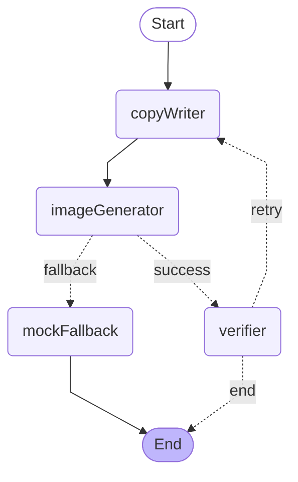

# 머지 가이드 — `feat/ai-pipeline` → `main`

> 인규님께. 이 브랜치는 MVP에 AI 파이프라인을 본격 통합한 작업입니다. 코덱스로 머지 진행 시 이 문서를 우선 읽어주세요.

## 한 줄 요약

`Solar Pro 3` (카피) → `Azure gpt-image-2` (카드뉴스 이미지) → `Upstage Information Extract` (자가 검증) — 이 흐름을 **LangGraph.js StateGraph**로 묶고 검증 실패 시 1회 재시도가 동작합니다.

## 커밋 누적 (시간순)

```
df4748c Tighten Solar copywriter prompt for length and accuracy
cdd5b7a Allow LAN dev origins for WSL access
bddd3d3 Integrate Azure gpt-image-2 with rate-limit retry
9fc6682 Replace pipeline with LangGraph.js StateGraph and conditional fallback
f2002d5 Expose agent graph as Mermaid via /api/agent-graph
43d4f96 Document the LangGraph agent flow in READMEs with Mermaid diagram
55b1874 Steer image prompt to card-news style and raise quality to medium
5e34670 Add Upstage IE verifier node with retry on missing keywords
```

`5cdaec1` (MVP Redesign) 이후 main에 추가 커밋이 없다면 **fast-forward 머지** 가능.

## 변경 파일

### 신규
- `lib/agent/state.ts` — LangGraph `Annotation.Root` State
- `lib/agent/graph.ts` — StateGraph 정의, 조건부 엣지, retry 가드
- `lib/agent/nodes/copy-writer.ts` — Solar 호출 + retry 시 피드백 주입
- `lib/agent/nodes/image-generator.ts` — Azure 호출 + 성공/실패 라우팅 신호
- `lib/agent/nodes/mock-fallback.ts` — SVG mock 안전망
- `lib/agent/nodes/verifier.ts` — Upstage IE 호출 + missing 산출
- `lib/agent/README.md` — 그래프/노드/채널 디테일
- `lib/image-gen.ts` — Azure gpt-image-2 (429 자동 재시도, 180초 timeout)
- `lib/verify.ts` — Upstage IE API + 키워드 매칭 로직
- `app/api/agent-graph/route.ts` — `GET`으로 Mermaid 그래프 응답

### 수정
- `lib/solar.ts` — 시스템 프롬프트 강화 (길이/환각/카드뉴스 스타일)
- `lib/generator.ts` — 절차적 함수 호출 → `promotionGraph.invoke()`로 교체
- `lib/types.ts` — `Verification` 타입 추가, `GeneratedContent.verification` 추가
- `README.md` — Stack/Environment/API 갱신, Agent Pipeline 섹션 신규
- `next.config.ts` — `allowedDevOrigins` 추가 (WSL/LAN dev 접근용)
- `package.json` / `package-lock.json` — `@langchain/langgraph`, `@langchain/core`
- `.env.example` — Azure 변수 4개 추가

### 그대로 유지
- `lib/mock-image.ts` — `mockFallback` 노드가 그대로 활용
- `app/api/promotion/*` — 라우트 표면(API) 변경 없음 — `generator.ts`가 내부적으로 그래프 호출
- `app/page.tsx` — UI 변경 없음 (의도적 — UI 통합은 별도 작업으로)

## 새 환경 변수 (반드시 추가)

`.env.local`에 다음 4개 채워야 이미지가 진짜 PNG로 나옵니다. 안 채우면 mock SVG fallback으로 자동 분기.

```
AZURE_IMAGE_ENDPOINT=https://<resource>.cognitiveservices.azure.com
AZURE_IMAGE_DEPLOYMENT=gpt-image-2
AZURE_IMAGE_API_VERSION=2024-02-01
AZURE_IMAGE_API_KEY=
```

`UPSTAGE_API_KEY`는 기존 변수 그대로. Verifier도 같은 Upstage 키 사용.

## 새 의존성

```bash
npm ci   # package-lock.json에 이미 박혀있음
# 또는 새로 설치 시
npm install @langchain/langgraph @langchain/core
```

## 새 API 엔드포인트

- `GET /api/agent-graph` — 컴파일된 LangGraph를 Mermaid 텍스트로 응답

## Agent Graph



자세한 노드 책임/State 채널/엣지 조건은 `lib/agent/README.md`.

## Retry 가드 (무한 루프 0%)

`lib/agent/graph.ts`:
- `MAX_VERIFY_ATTEMPTS = 2` 상수로 verifier 최대 2회 호출 (= retry 최대 1회)
- IE 호출이 실패하면 `verification.skipped: true`로 처리 → 자동 ok 취급 → retry 안 감

## 머지 시 주의사항

1. **충돌 가능성** — main에 추가 변경 없으면 conflict 거의 없음. `lib/generator.ts`와 `lib/types.ts`는 main 작업이 같이 손댔다면 충돌 가능 — 그래프 흐름이 핵심이므로 우리 브랜치 쪽 우선 채택.
2. **`.env.local`** — `.gitignore` 항목, 절대 커밋 안 됨. 환경별로 직접 채워야 함.
3. **`next.config.ts`의 `allowedDevOrigins`** — 현재 `["172.31.49.222", "localhost", "127.0.0.1"]`로 박혀있음 (유현님 WSL IP). main 환경에서 다르면 변경 필요. 또는 Vercel 배포 시 Production에선 dev-only라 영향 없음.
4. **`lib/mock-image.ts`** — 인규님 작품 그대로 유지. 이미지 API 미정 상태에서도 데모가 끊기지 않도록 fallback 노드로 활용.
5. **`agentTrace` 형식 변경** — 정적 5단계("Analyze/Strategy/Text/Image/Review") → **실제 노드 실행 흔적**으로 바뀜. UI가 정확한 step 이름에 의존했다면 `app/page.tsx`에서 step에 따라 분기하지 않는지 확인 필요 (현재 코드는 텍스트만 표시해 영향 없음).

## 테스트

```bash
npm ci
cp .env.example .env.local        # 4개 키 채움
npm run lint                      # tsc --noEmit
npm run dev
```

브라우저: http://localhost:3000

API 직접:
```bash
curl -X POST http://localhost:3000/api/promotion \
  -H "Content-Type: application/json" \
  -d '{
    "store":{"storeName":"소마분식","category":"한식당","vibe":"따뜻하고 정갈한"},
    "purpose":"new-menu",
    "detail":"된장찌개 한상 신메뉴 출시",
    "platform":"instagram"
  }'
```

응답 확인 포인트:
- `mockImage.dataUrl` → `data:image/png;base64,...` 시작 (Azure 성공 시) 또는 `data:image/svg+xml;...` (mock fallback)
- `agentTrace` → CopyWriter / ImageGenerator / Verifier 순서, 각 노드의 실제 결과가 한국어로 박힘
- `verification.ok` / `verification.missing[]` / `verification.extracted` → 검증 결과
- `source: "solar"` (Solar 호출 성공 시)

타이밍:
- Solar 카피: 2-5초
- Azure gpt-image-2 (quality medium): **60-90초**
- Upstage IE 검증: 5-10초
- 첫 시도 ok 케이스: 약 70-100초
- retry까지 가면 약 2-3분

## 트러블슈팅 메모 (디버깅 중 발견 — 인규님이 다시 안 부딪히게)

- **gpt-image-2 PNG는 `output_compression < 100` 거부** (PNG는 무손실). 코드에서 PNG일 때 compression 파라미터 제외함.
- **gpt-image-2 quality "medium"은 60-90초** — fetch timeout 180초로 잡음 (`lib/image-gen.ts`).
- **Azure S0 tier rate limit 429** 자주 걸림 — `Retry-After` 헤더/메시지 파싱 후 1회 자동 재시도.
- **Next.js 16 cross-origin 차단** — WSL IP/LAN으로 dev 페이지 열면 React hydration 안 됨 (form이 일반 GET submit). `allowedDevOrigins`로 해결.
- **Upstage IE 엔드포인트는 `/v1/chat/completions`이 아닌 별도 `/v1/information-extraction`** — 처음 헷갈렸음.
- **Upstage IE는 `messages.content`에 image_url 단독만 받음** — text instruction 같이 보내면 400. instruction은 `response_format.json_schema.schema`의 description으로 박아야 함.
- **Upstage IE schema 제약** — first-level properties에 union 타입(`["string","null"]`) 금지, 단일 타입만. nullable 표현은 빈 문자열 default로 대체.

## 향후 작업 (이 브랜치엔 미포함)

- 제품 사진 reference 입력 (`images/edits` + 폼 업로드 UI)
- UI에 `verification` 결과 배지(✓ 정합 / ⚠ 누락) 표시
- GPT-4o 비전으로 검증 정밀도 보강 (현재 OCR 기반 → 자연어 종합 평가 추가)
- 카피 자체 검증 노드 (`copyCritic`) — 길이·환각 코드 규칙 + Solar self-check
- 다른 케이스 테스트 (브런치 카페/도예 공방/반찬 가게 — 샘플 폼 그대로 활용 가능)

## 참고 링크

- 그래프 디테일: [`lib/agent/README.md`](./lib/agent/README.md)
- 메인 README: [`README.md`](./README.md)
- Azure gpt-image-2: https://platform.openai.com/docs/models/gpt-image-2 (Azure 호환)
- Upstage Information Extract: https://console.upstage.ai/docs/capabilities/information-extraction
- LangGraph.js: https://langchain-ai.github.io/langgraphjs/
