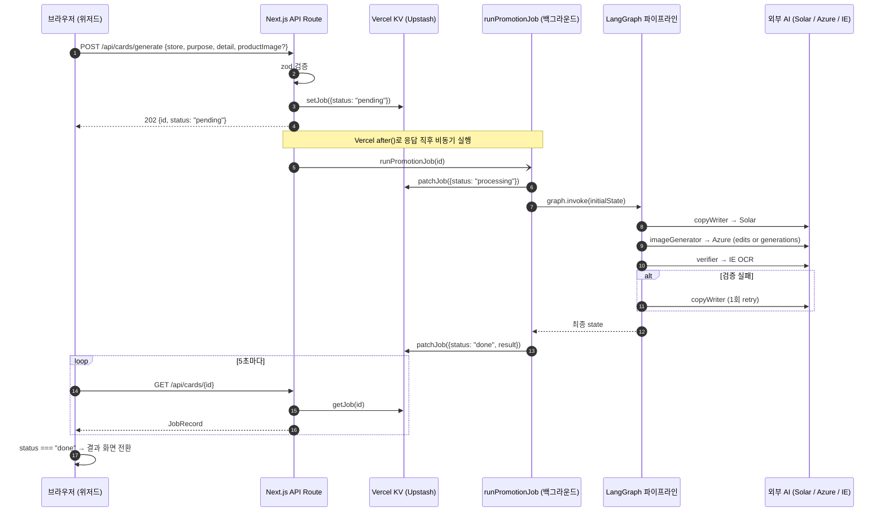

# 사장님메이트 (SOMA17 AI 17조 메인 프로젝트)

**소상공인을 위한 인스타 카드뉴스 도우미.** 가게 정보만 입력하면 AI 에이전트가 카드 한 장과 SNS 캡션, 해시태그를 만들어 줍니다.

> 처음 합류한 개발자를 위한 종합 가이드입니다. 모든 파일 경로, 동작 흐름, 환경 변수, 배포 절차를 한 문서에서 확인할 수 있습니다.

- 프로덕션: <https://soma17-ai17-main-project.vercel.app>
- Repo: `git@github.com:soma17th-ai17/main-project.git`

---

## 목차

1. [빠른 시작](#빠른-시작-5분)
2. [기능 / 화면](#기능--화면)
3. [기술 스택](#기술-스택)
4. [프로젝트 구조](#프로젝트-구조)
5. [요청 흐름](#요청-흐름-사용자-입력부터-결과-화면까지)
6. [LangGraph 파이프라인](#langgraph-파이프라인)
7. [API 명세](#api-명세)
8. [환경 변수](#환경-변수)
9. [Vercel KV (Upstash Redis) 설정](#vercel-kv-upstash-redis-설정)
10. [로컬 개발 / 검증](#로컬-개발--검증)
11. [Vercel 배포](#vercel-배포)
12. [알려진 한계 / 트러블슈팅](#알려진-한계--트러블슈팅)

---

## 빠른 시작 (5분)

```bash
git clone git@github.com:soma17th-ai17/main-project.git
cd main-project
npm install
cp .env.example .env.local       # 키는 비워둬도 mock으로 동작합니다
npm run dev                       # http://localhost:3000
```

키를 전혀 설정하지 않아도 동작합니다. 그 경우 카피는 결정적 fallback 문장, 이미지는 mock SVG가 나옵니다 (실제 LLM/Azure 호출 없음).

---

## 기능 / 화면

| 경로 | 파일 | 설명 |
|---|---|---|
| `/` | `src/app/page.tsx` | 랜딩 — Hero, 4단계 안내, CTA |
| `/studio` | `src/app/studio/page.tsx` | 3단계 위저드 |

`/studio` 위저드는 다음 3단계로 구성됩니다 (`src/components/studio/wizard-shell.tsx` 가 단계 전환 + 폴링 담당):

1. **가게 정보 입력** (`store-form.tsx`) — 가게명·업종·분위기·홍보 목적·상세 내용·제품 사진(선택)·플랫폼
2. **AI 작업 진행** (`processing-step.tsx`) — CopyWriter → ImageGenerator → Verifier 4-스텝 라이브 트레이스 + 5초 폴링
3. **결과 확인** (`result-step.tsx`) — 카드 1장 · 캡션 · 해시태그 · 검증 배지 · 피드백 재생성

---

## 기술 스택

| 레이어 | 사용 라이브러리 |
|---|---|
| 프레임워크 | Next.js 16 (App Router · Turbopack) + React 19 |
| 스타일링 | Tailwind CSS v4 (`@theme`), shadcn/ui (Radix · Nova preset) |
| 애니메이션 / UX | Motion (Framer Motion 후속), sonner (토스트), lucide-react (아이콘) |
| 폼 | react-hook-form + zod (`@hookform/resolvers`) |
| 에이전트 오케스트레이션 | LangGraph.js (`@langchain/langgraph`, `@langchain/core`) |
| 외부 LLM/이미지 | Upstage Solar Pro 3 (텍스트), Azure OpenAI gpt-image-2 (이미지), Upstage Information Extract (검증) |
| 잡 영속화 | Vercel KV (`@upstash/redis`) — 미연결 시 in-memory `Map` fallback |
| 테스트 | Playwright (`@playwright/test`) |

---

## 프로젝트 구조

```
main-project/
├── src/
│   ├── app/                              ← Next.js App Router
│   │   ├── page.tsx                      ← 랜딩 페이지 (/)
│   │   ├── studio/page.tsx               ← 위저드 페이지 (/studio)
│   │   ├── layout.tsx                    ← 루트 레이아웃 (theme, sonner)
│   │   └── api/
│   │       ├── cards/
│   │       │   ├── generate/route.ts     ← POST: 잡 생성 + 백그라운드 시작
│   │       │   ├── [id]/route.ts         ← GET: 잡 상태 폴링
│   │       │   └── [id]/retry/route.ts   ← POST: 피드백으로 재생성
│   │       ├── agent-graph/route.ts      ← GET: LangGraph Mermaid 다이어그램
│   │       └── health/route.ts           ← GET: 헬스체크
│   ├── components/
│   │   ├── landing/                      ← 랜딩 섹션 컴포넌트들
│   │   ├── studio/                       ← 위저드 단계별 컴포넌트
│   │   │   ├── wizard-shell.tsx          ← 단계 전환 + 5초 폴링 컨트롤러
│   │   │   ├── store-form.tsx            ← 1단계: 입력 폼 (productImage 업로드 포함)
│   │   │   ├── processing-step.tsx       ← 2단계: 진행 상황 시각화
│   │   │   ├── result-step.tsx           ← 3단계: 결과 + 피드백 재생성
│   │   │   └── step-progress.tsx
│   │   ├── site/                         ← 헤더/푸터
│   │   └── ui/                           ← shadcn 프리미티브
│   └── lib/
│       ├── agent/
│       │   ├── graph.ts                  ← StateGraph 조립 (노드 + 조건부 엣지)
│       │   ├── state.ts                  ← Annotation 채널 정의
│       │   ├── nodes/
│       │   │   ├── copy-writer.ts        ← Solar 호출 노드
│       │   │   ├── image-generator.ts    ← Azure 이미지 호출 노드 (분기)
│       │   │   ├── mock-fallback.ts      ← 실패 시 SVG mock 노드
│       │   │   └── verifier.ts           ← Upstage IE OCR 검증 노드
│       │   └── README.md                 ← 그래프/노드/채널 상세 문서
│       ├── generator.ts                  ← runPromotionJob: 그래프 실행 + KV 갱신
│       ├── store.ts                      ← KV (또는 in-memory) JobRecord CRUD
│       ├── solar.ts                      ← Upstage Solar 클라이언트
│       ├── image-gen.ts                  ← Azure 이미지 클라이언트 (text/edit 분기)
│       ├── mock-image.ts                 ← SVG mock 생성기
│       ├── verify.ts                     ← Upstage IE 검증 헬퍼
│       ├── types.ts                      ← 도메인 타입 (PromotionRequest, JobRecord 등)
│       └── utils.ts
├── e2e/                                   ← Playwright 스모크 테스트
├── public/                                ← 정적 자산
├── .env.example                           ← 키 템플릿
├── components.json                        ← shadcn 설정
├── next.config.ts
├── tailwind.config / postcss.config       ← Tailwind v4
├── playwright.config.ts
└── README.md                              ← (이 문서)
```

---

## 요청 흐름 (사용자 입력부터 결과 화면까지)



핵심 포인트:

- **즉시 응답 + 백그라운드**: POST는 잡 ID만 반환하고 실제 AI 호출은 Vercel `after()`로 응답 후 진행. 브라우저는 GET으로 폴링하여 진행 상황을 받습니다 (서버리스 함수 응답 타임아웃 회피).
- **JobRecord가 단일 진실원**: 모든 상태/결과는 `JobRecord`(`src/lib/types.ts`)에 담겨 KV에 저장됩니다. POST/GET이 다른 람다 인스턴스에 라우팅돼도 동일한 KV를 공유.
- **외부 키 미설정 시 fallback**: 키가 없거나 호출 실패 시에도 mock으로 결과가 나오도록 안전망이 깔려 있어 데모 흐름이 끊기지 않습니다.
- **KV 미연결 시 in-memory**: `KV_REST_API_URL` 미설정이면 `globalThis` Map fallback. 이 경우 서버리스 인스턴스 간 격리로 폴링이 404를 받을 수 있습니다 (운영 시 KV 연결 권장).

---

## LangGraph 파이프라인


- `imageGenerator` 노드는 단일 노드. 내부의 `lib/image-gen.ts`가 `productImage` 유무로 Azure 엔드포인트만 가려 호출.
- Verifier가 핵심 키워드 누락을 발견하면 `copyWriter`로 1회 재진입 (피드백 자동 주입). `MAX_VERIFY_ATTEMPTS=2`로 무한 루프 방지.
- 사진 입력은 `state.request`에 보관되어 retry 시에도 유지됩니다.
- 런타임 그래프는 `GET /api/agent-graph`에서 동적으로 받을 수 있습니다.
- 노드/채널 상세는 [`src/lib/agent/README.md`](src/lib/agent/README.md) 참조.

---

## API 명세

| Method | Path | Body | Response |
|---|---|---|---|
| POST | `/api/cards/generate` | `PromotionRequest` (zod 검증) | `202 { id, status: "pending" }` |
| GET | `/api/cards/[id]` | — | `200 JobRecord` 또는 `404` |
| POST | `/api/cards/[id]/retry` | `{ feedback?: string }` | `202 { id, status: "pending" }` |
| GET | `/api/agent-graph` | — | `200 { mermaid: string }` |
| GET | `/api/health` | — | `200 { ok, solarConfigured, imageProvider, service }` |

핵심 타입 (자세한 정의는 `src/lib/types.ts`):

```ts
type PromotionRequest = {
  store: { storeName: string; category: string; vibe: string; description?: string };
  purpose: "new-menu" | "event" | "daily" | "reopening" | "review";
  detail: string;
  platform?: "instagram" | "naver" | "baemin";
  feedback?: string;
  productImage?: string;   // base64 data URL (PNG/JPEG/WebP, ≤6MB)
};

type JobRecord = {
  id: string;
  status: "pending" | "processing" | "done" | "error";
  request: PromotionRequest;
  result?: GeneratedContent;
  agentTrace: AgentTrace[];
  attempt?: number;
  error?: string;
  createdAt: string;
  updatedAt: string;
};
```

---

## 환경 변수

`.env.example`을 `.env.local`로 복사 후 채우세요. **모두 서버 전용** (브라우저 노출 X).

```bash
# Upstage Solar (텍스트 카피 + Information Extract 검증)
UPSTAGE_API_KEY=
UPSTAGE_MODEL=solar-pro3
UPSTAGE_BASE_URL=https://api.upstage.ai/v1

# Azure OpenAI Service (이미지 생성 — gpt-image-2)
AZURE_IMAGE_ENDPOINT=          # 예: https://<resource>.openai.azure.com
AZURE_IMAGE_DEPLOYMENT=gpt-image-2
AZURE_IMAGE_API_VERSION=2025-04-01-preview
AZURE_IMAGE_API_KEY=

# Vercel KV (자동 주입 — 직접 입력 X)
KV_REST_API_URL=               # Vercel 대시보드에서 KV 연결 시 자동 세팅
KV_REST_API_TOKEN=
```

| 키 | 미설정 시 동작 |
|---|---|
| `UPSTAGE_API_KEY` | 카피는 결정적 fallback 문장 사용. Verifier 자동 skip |
| Azure 4종 중 하나라도 미설정 | mock SVG 시안 (`mock-fallback`) |
| `KV_REST_API_URL` / `KV_REST_API_TOKEN` | in-memory `Map` fallback (개발 OK / 프로덕션 비권장) |

---

## Vercel KV (Upstash Redis) 설정

운영 환경에서 폴링이 안정적으로 동작하려면 Vercel KV 연결이 필수입니다 (서버리스 인스턴스 간 잡 상태 공유).

1. Vercel 대시보드 → 프로젝트 → **Storage** 탭
2. **Create Database** → **Upstash for Redis** 선택 → 무료 티어로 생성
3. 생성된 DB의 **Connect Project** → 본 프로젝트 선택
4. 자동으로 `KV_REST_API_URL` / `KV_REST_API_TOKEN`이 환경 변수로 주입됨
5. 다음 배포부터 `src/lib/store.ts`가 자동으로 KV 사용 (코드 변경 불필요)

무료 티어 한도 (Upstash Free): 10,000 commands/day, 256MB. 본 프로젝트 한 잡당 ~10 command (set + 4-5회 patch + 폴링당 get) 사용. 폴링은 5초 간격이라 잡 1건이 ~3분간 약 36회 GET → KV로는 ~36회 carrent count.

---

## 로컬 개발 / 검증

```bash
npm install
npm run dev          # next dev → http://localhost:3000
npm run lint         # eslint + tsc --noEmit (TypeScript 체크)
npm run build        # next build (production 빌드 — 실제 배포 전 반드시 실행)
npm run test:e2e     # Playwright smoke 테스트
```

E2E를 production URL 대상으로 실행하려면:

```bash
PLAYWRIGHT_BASE_URL=https://soma17-ai17-main-project.vercel.app npm run test:e2e
```

> **`npm run lint`는 ESLint뿐 아니라 `tsc --noEmit`도 실행**합니다. 빌드 전 lint를 통과시키면 타입 에러를 미리 잡을 수 있습니다.

---

## Vercel 배포

GitHub `main` 브랜치 push 시 Vercel이 자동으로 production 배포합니다.

- 배포 단위: 매 commit (자동 트리거)
- `maxDuration=300` (5분) — 이미지 생성 + 1회 retry 최대 ~3분 처리 시간 보장. **Vercel Pro 플랜 필요**. Hobby에서는 60초 캡.
- 잡 영속화: Vercel KV 연결 권장 (위 [Vercel KV 설정](#vercel-kv-upstash-redis-설정) 참조)
- 환경 변수: Vercel 대시보드 → Settings → Environment Variables 에서 production scope로 입력

수동 배포가 필요한 경우 Vercel CLI:

```bash
npx vercel --prod
```

---

## 알려진 한계 / 트러블슈팅

| 증상 | 원인 | 해결 |
|---|---|---|
| 폴링 GET이 가끔 404 | KV 미연결 + 서버리스 인스턴스 격리. POST와 GET이 다른 람다에 도달하면 in-memory Map이 공유되지 않음 | Vercel KV 연결 (위 섹션 참조) |
| 이미지가 항상 mock SVG | Azure 환경 변수 4종 중 일부 미설정 또는 잘못된 키 | `.env.local` 또는 Vercel 환경 변수 점검. `/api/health`로 `imageProvider` 확인 |
| 카피가 단조롭고 같은 패턴 | `UPSTAGE_API_KEY` 미설정 → fallback 카피 사용 | Upstage Solar 키 발급 후 환경 변수 설정 |
| Verifier 결과가 늘 `skipped` | Upstage 키 없음 또는 mock 이미지 분기 (mock일 때는 검증 생략) | Upstage 키 + 실제 Azure 이미지 동시에 동작해야 검증이 의미 있음 |
| 빌드 시 `next build` TypeScript 에러 | 타입 변경 후 lint 미실행 | `npm run lint`를 빌드 전 습관화 |
| Vercel 배포가 0ms로 Error 종료 | 코드 빌드 전 platform 레벨 거부 (드물게 발생) | 빈 commit (`git commit --allow-empty -m 'redeploy'`) push로 재트리거 |
| 위저드 진행 중 무한 대기 | 네트워크 또는 KV 미연결로 polling이 404 반환 | 브라우저 DevTools Network에서 GET 응답 코드 확인 → KV 연결 점검 |

---

## 더 알아보기

- LangGraph 노드/State 채널 상세: [`src/lib/agent/README.md`](src/lib/agent/README.md)
- Vercel App Router 비동기 작업 패턴: [`after()` docs](https://nextjs.org/docs/app/api-reference/functions/after)
- Upstage Solar API: <https://console.upstage.ai/docs>
- Azure OpenAI gpt-image-2: <https://learn.microsoft.com/azure/ai-services/openai/>
