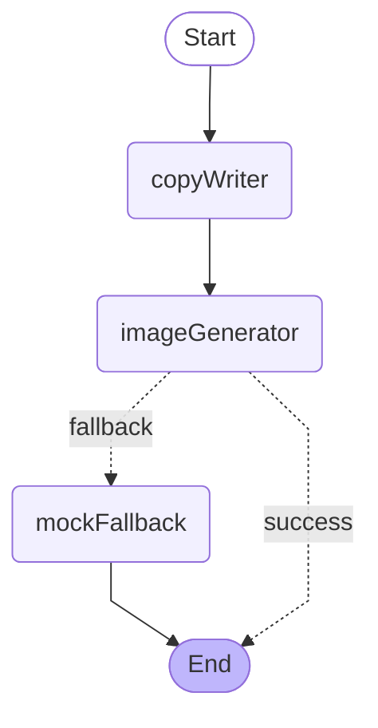

# SOMA 17 AI Promo

SW Maestro 17기 AI 기술교육 17조 메인 프로젝트 MVP입니다. 소상공인이 가게 정보와 홍보 목적을 입력하면 Solar 기반 홍보 문구와 mock 이미지를 생성합니다.

## Stack

- Next.js App Router
- Vercel target deployment
- Upstage Solar chat completions for text generation
- Azure OpenAI gpt-image-2 for image generation (with SVG mock fallback)
- LangGraph.js StateGraph for the agentic flow

## Local Run

```bash
npm install
npm run dev
```

Open `http://localhost:3000`.

## Environment

Copy `.env.example` to `.env.local` and fill only server-side values.

```bash
UPSTAGE_API_KEY=
UPSTAGE_MODEL=solar-pro3
UPSTAGE_BASE_URL=https://api.upstage.ai/v1

AZURE_IMAGE_ENDPOINT=
AZURE_IMAGE_DEPLOYMENT=
AZURE_IMAGE_API_VERSION=2024-02-01
AZURE_IMAGE_API_KEY=
```

If `UPSTAGE_API_KEY` is missing or the Solar request fails, the app returns deterministic fallback copy so the demo remains usable. If the Azure image call fails or is unconfigured, the graph routes to a `mockFallback` node that returns an SVG placeholder.

## Agent Pipeline

The promotion flow runs as a LangGraph.js `StateGraph` (`lib/agent/`).



Node details and state channels live in [`lib/agent/README.md`](./lib/agent/README.md). The compiled graph is also exposed as Mermaid via `GET /api/agent-graph`.

## API

- `GET /api/health`
- `POST /api/promotion`
- `GET /api/promotion/{id}`
- `POST /api/promotion/{id}/retry`
- `GET /api/agent-graph`

## Verification

```bash
npm run lint
npm run build
```

`npm run lint` is currently a TypeScript no-emit check.
