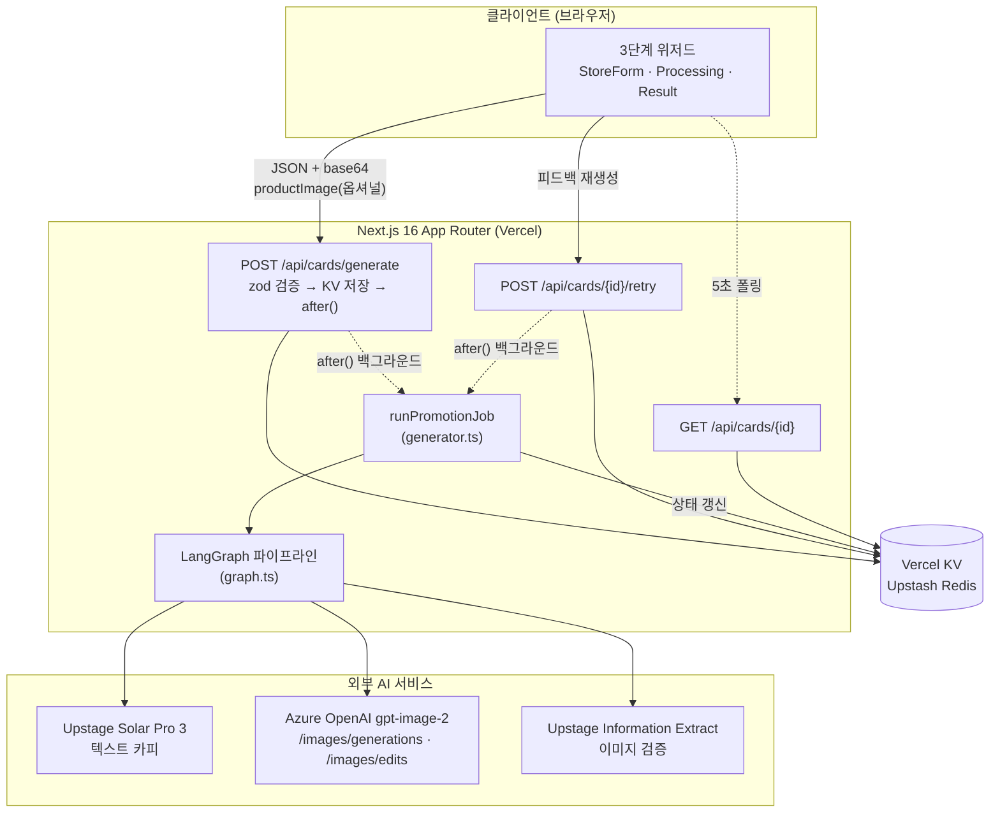
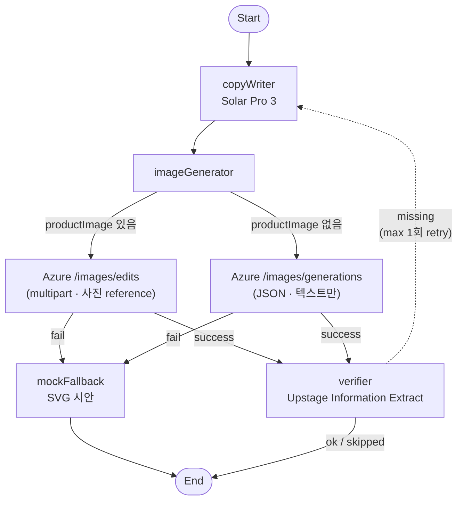

# 카드뜰 (SOMA17 AI 17조 메인 프로젝트)

소상공인을 위한 인스타 카드뉴스 도우미. 가게 정보만 입력하면
AI 에이전트가 카드 한 장과 SNS 캡션, 해시태그를 만들어 줍니다.

- Next.js 16 (App Router) + React 19
- Tailwind v4 + shadcn/ui (Radix · Nova preset)
- Motion (애니메이션) · sonner (토스트)
- LangGraph.js — Solar → Azure 이미지 → Upstage IE 검증 파이프라인
- Upstage Solar Pro 3 (텍스트) — 키 미설정 시 fallback 카피
- Azure GPT-Image-2 (이미지) — 키 미설정 시 mock SVG
- Upstage Information Extract — 이미지 OCR 검증 (선택)

## 화면 구성

- `/` — 랜딩 (Hero + 4단계 안내 + CTA)
- `/studio` — 3단계 위저드
  1. 가게 정보 입력 (가게명 · 업종 · 분위기 · 홍보 목적 · 상세 내용 · 제품 사진(선택) · 플랫폼)
  2. AI 작업 진행 (CopyWriter → ImageGenerator → Verifier 라이브 트레이스)
  3. 결과 확인 (카드 1장 · 캡션 · 해시태그 · 검증 배지 · 피드백 재생성)

## 아키텍처

### 전체 시스템 흐름



- 클라이언트는 `POST /api/cards/generate`로 작업을 시작하고, KV에 저장된 `JobRecord`를 `GET`으로 5초마다 폴링.
- 실제 AI 호출은 Vercel `after()`로 응답 직후 백그라운드에서 LangGraph 파이프라인이 처리.
- 외부 키 미설정 시 fallback (Solar → 결정적 카피, Azure → mock SVG, IE → 검증 skip).

### LangGraph 파이프라인



- EDIT / GEN은 같은 Azure 이미지 API의 두 엔드포인트. **`imageGenerator` 노드 자체는 단일 노드**이고, 그 안의 `generateAzureImage()` 라이브러리 단에서 `productImage` 유무로 엔드포인트만 가려 호출.
- Verifier가 핵심 키워드 누락을 발견하면 `copyWriter`로 1회 재진입(피드백 자동 주입). 사진 입력은 `state.request`에 있어 retry 시에도 그대로 유지됨.
- 자세한 노드/State 채널 정의는 [`src/lib/agent/README.md`](src/lib/agent/README.md) 참조.

## 로컬 실행

```bash
npm install
npm run dev
```

브라우저에서 `http://localhost:3000` 열기.

## 환경 변수

`.env.example` 을 `.env.local` 로 복사 후 채우세요. 모두 서버 전용입니다.

```bash
# Upstage Solar (텍스트 카피)
UPSTAGE_API_KEY=
UPSTAGE_MODEL=solar-pro3
UPSTAGE_BASE_URL=https://api.upstage.ai/v1

# Azure OpenAI Service (이미지 생성)
AZURE_IMAGE_ENDPOINT=
AZURE_IMAGE_DEPLOYMENT=gpt-image-2
AZURE_IMAGE_API_VERSION=2025-04-01-preview
AZURE_IMAGE_API_KEY=
```

- `UPSTAGE_API_KEY` 미설정 시 fallback 카피
- Azure 키 4종 중 하나라도 미설정 시 mock SVG 이미지
- Upstage IE 검증은 `UPSTAGE_API_KEY` 가 있을 때만 활성화됨

## API

- `POST /api/cards/generate` — body: `PromotionRequest`. 응답 `{ id, status: "pending" }` (202)
- `GET  /api/cards/[id]` — `JobRecord` (상태 폴링)
- `POST /api/cards/[id]/retry` — body: `{ feedback?: string }`. 응답 `{ id, status }` (202)

## 검증

```bash
npm run lint        # eslint
npm run build       # next build (TypeScript 체크 포함)
npm run test:e2e    # Playwright smoke (PLAYWRIGHT_BASE_URL 환경변수)
```

배포 후 production 검증:

```bash
PLAYWRIGHT_BASE_URL=https://soma17-ai17-main-project.vercel.app npm run test:e2e
```

## Vercel 배포

- Vercel CLI 로 배포되어 있습니다 (`vercel --prod`).
- 비동기 작업 패턴: POST 가 `after()` 로 백그라운드 작업 시작, GET 폴링.
- `maxDuration=300` (Pro 플랜 필요) — 이미지 생성 + 재시도 최대 ~3분.
- 잡 저장소는 in-memory (`globalThis`) — 콜드 스타트 시 상태 손실 가능 (MVP 한계).
