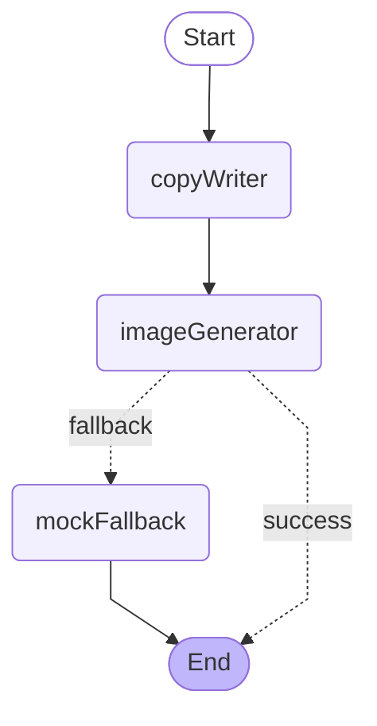

# Promotion Agent Graph

LangGraph.js 기반의 에이전틱 플로우. `lib/generator.ts`에서 호출하는 **3-노드 + 조건부 분기** 그래프입니다.

## Graph

런타임 그래프는 `GET /api/agent-graph`에서 동적으로 다시 받을 수 있습니다.

## Nodes

| 노드 | 파일 | 책임 |
|---|---|---|
| `copyWriter` | `nodes/copy-writer.ts` | Upstage Solar Pro 3로 카피·해시태그·imagePrompt 생성. 키 없거나 호출 실패 시 결정적 fallback 카피로 응답. |
| `imageGenerator` | `nodes/image-generator.ts` | Azure gpt-image-2로 1024x1024 PNG 생성. 429 rate-limit 1회 자동 재시도. 실패 시 `image`를 비워 fallback으로 라우팅 신호. |
| `mockFallback` | `nodes/mock-fallback.ts` | 카테고리 팔레트 기반 SVG mock 시안으로 안전 대체. 데모 흐름 보장용. |

## State Channels (`state.ts`)

| 채널 | 타입 | reducer |
|---|---|---|
| `request` | `PromotionRequest` | overwrite |
| `copy` | `SolarCopy \| undefined` | overwrite |
| `image` | `{ dataUrl, source: "azure" \| "mock" } \| undefined` | overwrite |
| `agentTrace` | `AgentTrace[]` | concat (각 노드가 push) |

## Conditional Edge

`imageGenerator` → `routeAfterImage(state)`:
- `state.image` 있으면 → `END` (success)
- 없으면 → `mockFallback` (fallback)

## 확장 포인트

- 검증 노드 추가: `imageGenerator` 뒤에 `verifier` 노드를 끼워 OCR로 핵심 키워드 누락 검출. 누락 시 `copyWriter`로 되돌리는 분기 추가 가능.
- 제품 사진 reference: `imageGenerator`에서 `images/edits` 엔드포인트로 multipart 호출, `state.request.productImage` 입력에 따라 분기.
