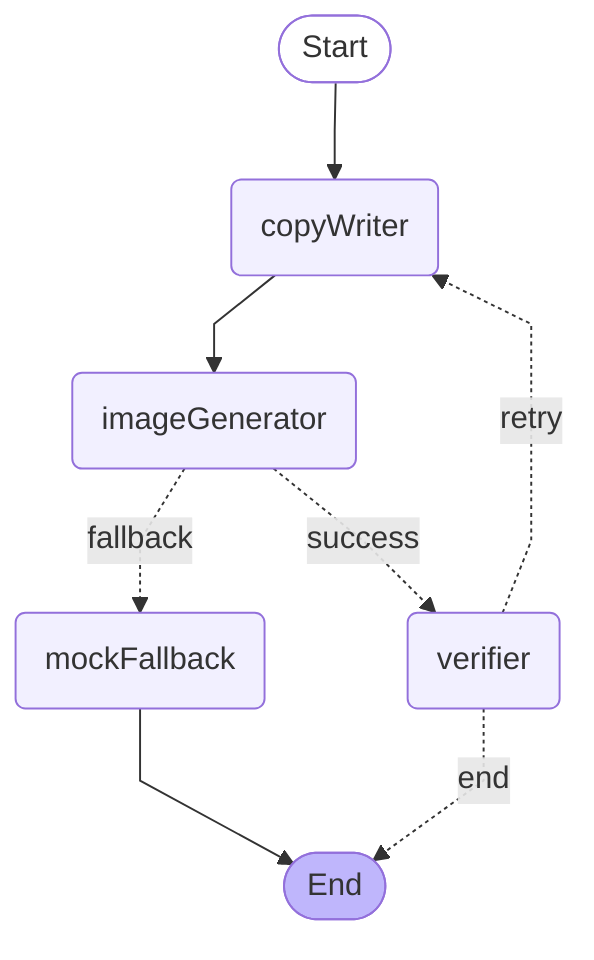

# Promotion Agent Graph

LangGraph.js 기반의 에이전틱 플로우. `src/lib/generator.ts`에서 호출하는 **4-노드 + 조건부 분기 + 1회 retry** 그래프입니다.

## Graph

런타임 그래프는 `GET /api/agent-graph`에서 동적으로 다시 받을 수 있습니다.

## Nodes

| 노드 | 파일 | 책임 |
|---|---|---|
| `copyWriter` | `nodes/copy-writer.ts` | Upstage Solar Pro 3로 카피·해시태그·imagePrompt 생성. 키 없거나 호출 실패 시 결정적 fallback 카피로 응답. 재시도일 때는 `verification.missing`을 `feedback`에 주입해 재호출. |
| `imageGenerator` | `nodes/image-generator.ts` | Azure gpt-image-2로 1024x1024 PNG 생성. **`state.request.productImage` 있으면 `/images/edits` multipart, 없으면 `/images/generations` JSON** (분기는 `lib/image-gen.ts` 내부). 429 rate-limit 1회 자동 재시도. 실패 시 `image`를 비워 fallback으로 라우팅 신호. |
| `mockFallback` | `nodes/mock-fallback.ts` | 카테고리 팔레트 기반 SVG mock 시안으로 안전 대체. 데모 흐름 보장용. |
| `verifier` | `nodes/verifier.ts` | Upstage Information Extract(`information-extract` 모델, `/v1/information-extraction` 엔드포인트) 호출로 카드 이미지에서 storeName/dish/benefit/koreanText 추출 → 입력 키워드와 정합성 검증. Mock 분기는 검증 생략. |

## State Channels (`state.ts`)

| 채널 | 타입 | reducer |
|---|---|---|
| `request` | `PromotionRequest` | overwrite |
| `copy` | `SolarCopy \| undefined` | overwrite |
| `image` | `{ dataUrl, source: "azure" \| "mock" } \| undefined` | overwrite |
| `verification` | `Verification \| undefined` | overwrite |
| `attempt` | `number` (default 0) | overwrite |
| `agentTrace` | `AgentTrace[]` | concat (각 노드가 push) |

## Conditional Edges

`imageGenerator` → `routeAfterImage(state)`:
- `state.image` 있으면 → `verifier` (success)
- 없으면 → `mockFallback` (fallback)

`verifier` → `routeAfterVerify(state)`:
- `verification.ok` 또는 `verification.skipped` → `END`
- `state.attempt >= MAX_VERIFY_ATTEMPTS(2)` → `END` (무한 루프 방지)
- 그 외(누락 검출) → `copyWriter` (retry, missing이 다음 imagePrompt에 주입됨)

## 확장 포인트

- 검증 정밀도 향상: `verifier`에 GPT-4o 비전을 보조로 끼워 자연어 종합 평가 결합.
- 카피 자체 검증: 별도 `copyCritic` 노드에서 길이·환각 코드 규칙 + Solar self-check.
